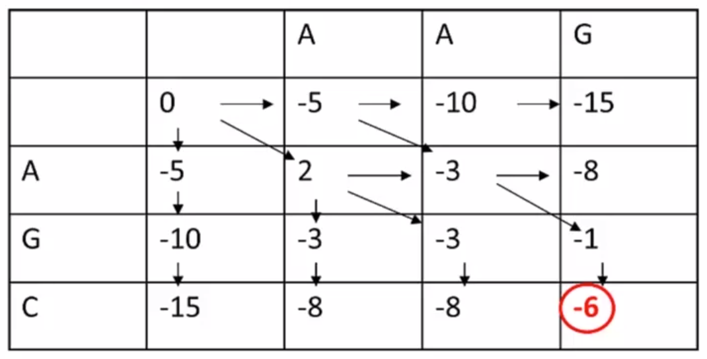
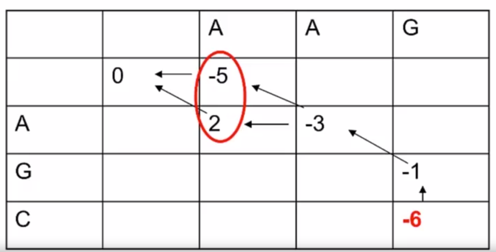

## 简介

Smith-Waterman算法和Needleman-Wunsch算法都是生物信息学领域非常经典的算法，主要用于基因或者蛋白质序列的比对。

Neeleman-Wunsch算法是基于生物信息学知识来匹配蛋白序列或者基因序列的算法，是将动态规划算法应用于生物序列的比较的早期实践之一。

Smith-Waterman算法是Needleman-Wunsch算法的延伸，相比于Needleman算法主要聚焦于一整条序列的全局比对，Smith算法更多的用于找寻两个序列中具有高度相似度的片段。

## Needleman-Wunsch算法原理

NW算法主要用于对比两个序列并得到这两个序列的全部序列匹配。

假设两个待比对序列为：AAG 和 AGC ，且不同的碱基对应的分值如下表所示，空值的罚分为线性距离，值为-5 。

|    |  A |  C |  G |  T |
|----|----|----|----|----|
|  A |  2 | -7 | -5 | -7 |
|  C | -7 |  2 | -7 | -5 |
|  G | -5 | -7 |  2 | -7 |
|  T | -7 | -5 | -7 |  2 |

即DP矩阵中计算分数的公式为：

$$
\\begin{equation}
F(0,0)=0 ，
\\end{equation}
$$
$$
\\begin{equation}
F(i,j)= max 
\\left \\{
    \begin{array}{lr}
    F(i-1,j-1)+s(x_i, y_j), \\\\
    F(i-1,j)+d, \\\\
    F(i,j-1)+d, \\\\
    \end{array}
\\right.
\\end{equation}
$$

计算所得结果如下图：

然后回溯得到对比结果： 

关于回溯：在北大的生物信息学导论课程中并没有提及回溯的具体方式，不过可以参考下面这篇博客：https://blog.csdn.net/yohjob/article/details/89144032 

## Smith-Waterman算法

Smith-Waterman算法与Needleman-Wunsch算法差别并不大，主要存在的差异是DP矩阵的计算公式，Smith-Waterman算法给公式的值规定了最小值从而突出局部特征。公式如下所示：
$$
\\begin{equation}
F(0,0)=0 ，
\\end{equation}
$$
$$
\\begin{equation}
F(i,j)= max  \\left\\{
    \\begin{array}{lr}
    F(i-1,j-1)+s(x_i, y_j), \\\\
    F(i-1,j)+d, \\\\
    F(i,j-1)+d, \\\\
    0 , \\\\
    \\end{array}
\\right.
\\end{equation}
$$