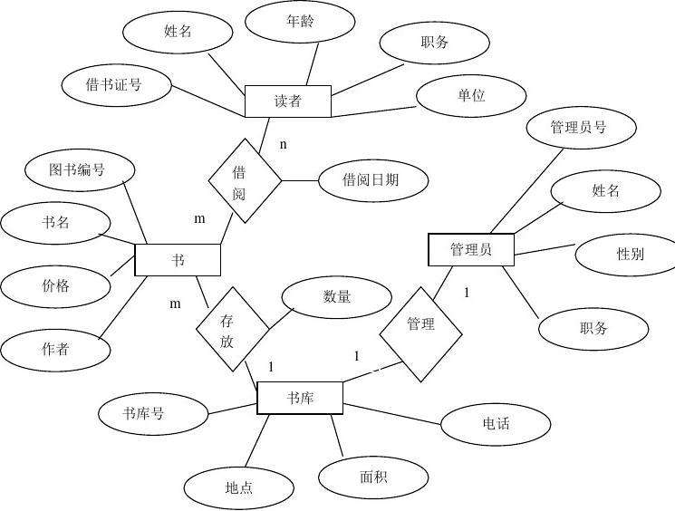

# 数据库（数据仓库）
数据库是`长期储存`在计算机内、有组织的、可共享的大量数据的集合

数据库中的数据按照一定的数据模型组织、描述、存储。具有较小冗余度、较高数据独立性和易扩展性，并且可以为各种用户共享。

数据库的基本特点：  
1. 永久存储
2. 有组织
3. 可共享

## 数据库管理系统
用户通过数据库管理系统操作数据库，数据库管理系统将操作系统的接口封装，为用户提供数据的定义、组织、存储、管理、操纵、数据库的事务管理和运行、数据库的建立和维护等工作。

## 数据库系统
数据库系统内包含数据库、数据库管理系统、应用程序和数据库管理员。

数据库系统是用于存储、管理、处理和维护数据的系统

`数据库系统与文件系统的区别：数据的结构化`

## 数据模型
概念模型：对数据和信息的建模  
逻辑模型：数据之间的逻辑结构组成的模型  
物理模型：物理机上存储的模型  

### Definitions
 - 实体(Entity)：客观存在并可以互相区别的事务
 - 属性(Attribute)：实体的某一特性
 - 码(Key)：唯一标识实体的属性集
 - 实体型(Entity Set)：同一类型实体的集合
 - 联系(Relationship)：实体之间的联系，通常指不同`实体集`之间的联系

### E-R图


### 范式
1. 第一范式(确保每列保持原子性)
   - 第一范式是最基本的范式。如果数据库表中的所有字段值都是不可分解的原子值，就说明该数据库表满足了第一范式。
   - 第一范式的合理遵循需要根据系统的实际需求来定。
   - 比如某些数据库系统中需要用到“地址”这个属性，本来直接将“地址”属性设计成一个数据库表的字段就行。但是如果系统经常会访问“地址”属性中的“城市”部分，那么就非要将“地址”这个属性重新拆分为省份、城市、详细地址等多个部分进行存储，这样在对地址中某一部分操作的时候将非常方便。
2. 第二范式(确保表中的每列都和主键相关)
   - 第二范式在第一范式的基础之上更进一层。第二范式需要确保数据库表中的每一列都和主键相关，而不能只与主键的某一部分相关（主要针对联合主键而言）。也就是说在一个数据库表中，一个表中只能保存一种数据，不可以把多种数据保存在同一张数据库表中。
   - 比如要设计一个订单信息表，因为订单中可能会有多种商品，所以要将订单编号和商品编号作为数据库表的联合主键。
3. 第三范式(确保每列都和主键列直接相关,而不是间接相关)
   - 第三范式需要确保数据表中的每一列数据都和主键直接相关，而不能间接相关。
   - 比如在设计一个订单数据表的时候，可以将客户编号作为一个外键和订单表建立相应的关系。而不可以在订单表中添加关于客户其它信息（比如姓名、所属公司等）的字段。

## SQL语句
### 索引
- hash索引：O(1)操作，适合单值查询，如 *=、in*
- btree索引：适合单值查询和范围查询，如 *<、>、between*

### `UNION`操作符
```SQL
SELECT column_name FROM table1
UNION
SELECT column_name FROM table2;
```
`UNION`操作符的作用是合并两个或者多个`SELECT`语句的查询结果。  
`UNION`操作默认选取不同的值。如果需要允许重复的值，需要使用`UNION ALL`。
```SQL
SELECT column_name FROM table1
UNION ALL
SELECT column_name FROM table2;
```

### `SELECT INTO`语句
MySQL不支持该语句，但可以用`INSERT INTO ... SELECT ...`代替。  
下面语句将table1所有的列复制进newtable
```SQL
SELECT * INTO newtable FROM table1;
```
或者也可以将table1中的指定列复制进newtable
```SQL
SELECT comun_name INTO newtable FROM table1;
```

### `IN`操作符
`IN`操作符可以让`WHERE`在多个值中选择。
```SQL
SELECT column_name1,column_name2,... 
FROM table1 
WHERE column IN (value1, value2, ...);
```

### `BETWEEN`操作符
`BETWEEN`操作符可以选取介于两个值之间的数据范围内的值。
```SQL
SELECT column_name1, column_name2, ... 
FROM table1 
WHERE column BETWEEN value1 AND value2;
```
value的值可以是数字、字符或者日期。  
在MySQL中，`BETWEEN`操作符的选择会包括*value1*和*value2*。

### `ORDER BY`关键字
`ORDER BY`关键字用于对结果集合进行排序，排序结果可以是升序或者降序。
```SQL
SELECT column_name1, column_name2, ...
FROM table1
ORDER BY column_name1, column_name2, ... ASC;
```
升序操作为`ASC`，是默认的；降序操作为`DESC`。  
当有多个关键字需要排序时，将会按照语句中给出的顺序作为优先级进行排序。

### `JOIN`连接符
`JOIN`连接符用于将两个或是多个表的行结合起来。包括`LEFT JOIN, RIGHT JOIN, INNER JOIN, OUTER JOIN`。

- INNER JOIN：如果表中有至少一个匹配，则返回行
- LEFT JOIN：即使右表中没有匹配，也从左表返回所有的行
- RIGHT JOIN：即使左表中没有匹配，也从右表返回所有的行
- FULL JOIN：只要其中一个表中存在匹配，则返回行

### `CHECK`约束
`CHECK`约束用于限制列中的值得范围。
```SQL
CREATE TABLE Persons
(
   P_Id int NOT NULL,
   LastName varchar(255) NOT NULL,
   FirstName varchar(255),
   Address varchar(255),
   City varchar(255),
   CHECK (P_Id>0)
);
```
或者在`ALTER TABLE`语句中
```SQL
ALTER TABLE Persons
ADD CHECK (P_Id>0);
```

### `CREATE INDEX`语句
该语句可用于在表中创建索引。在不读取整个表的情况下，索引可以加快数据库查找数据的速度。

可以使用下列语句创建一个索引
```SQL
CREATE INDEX index_name
ON table_name (column_name, ...);
```
一个索引可以不只联系一个列，可以将多个列共同索引。  

可以使用下列语句创建一个唯一索引
```SQL
CREATE UNIQUE INDEX index_name
ON table_name (column_name, ...);
```
唯一索引不允许有两个相同值的行存在。


### `LIKE`操作符
`LIKE`操作符用于在`WHERE`子句中搜索列中的指定模式，使用`%`作为字符通配符，例如`%Y`将会匹配所有以`Y`结尾的字符串。
```SQL
SELECT column_name, column_name1, ... 
FROM table_name
WHERE column_name LIKE pattern;
```
通常情况下，pattern中的通配符有两种：
- `%`：替代0个或多个字符
- `_`：替代一个字符

但是若要匹配正则表达式，则可以使用如下语句
```SQL
SELECT * FROM Websites
WHERE name REGEXP '^[GFs]';
```
上述语句将匹配所有以G、F、s开头的列。

### `AUTO_INCREMENT`
在MySQL中，创建表时添加`AUTO_INCREMENT`字段可以让属性自增。
```SQL
CREATE TABLE Persons
(
   ID int NOT NULL AUTO_INCREMENT,
   LastName varchar(255) NOT NULL,
   FirstName varchar(255),
   Address varchar(255),
   City varchar(255),
   PRIMARY KEY (ID)
);
```
默认地，AUTO_INCREMENT 的开始值是 1，每条新记录递增 1。

要让 AUTO_INCREMENT 序列以其他的值起始，可以使用下面的 SQL 语法：
```SQL
ALTER TABLE Persons AUTO_INCREMENT=100
```

### `ALTER TABLE`
该语句可以用于修改已有的表的列。
1. 在表中添加列 
   ```SQL
   ALTER TABLE table_name
   ADD column_name datatype
   ```
2. 在表中删除列
   ```SQL
   ALTER TABLE table_name
   DROP COLUMN column_name
   ```
3. 在表中修改列
   ```SQL
   ALTER TABLE Persons
   ALTER COLUMN column_name datatype
   ```

