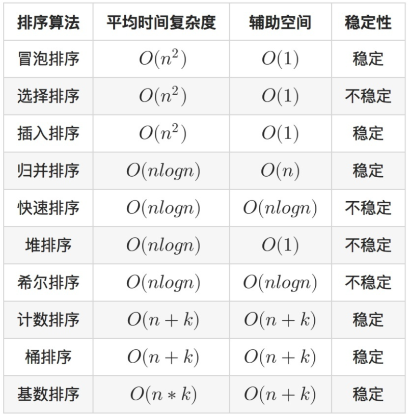

## 一、 数据结构与算法分析的基本概念  

### （一）数据结构的基本概念  
   1. 数据  
    数据是信息的载体，是描述客观事物属性的数字、字符以及所有能输入到计算机中被程序识别和处理的符号的集合
   2. 数据元素  
       数据元素是数据的基本单位，一个数据元素由若干个 `数据项` 组成，**数据项是数据元素中不可分割的最小单位**。
   3. 数据对象  
       **数据对象是具有相同性质的数据元素的集合**，是数据的一个子集。
   4. 数据类型  
       数据类型是一个值的集合和定义在此集合上的一组操作的统称
       - 原子类型：值不可再分的数据类型
       - 结构类型：值可以再分解为若干分量的数据类型
       - 抽象数据类型(ADT) ：抽象数据组织以及相关操作，可以用抽象数据类型定义一个完整的数据结构
   5. 数据结构  
       数据结构是相互之间存在一种或多种特定关系的数据元素的集合。数据元素之间的关系被称为结构。数据结构包括：**逻辑结构、存储结构、数据运算**。
       数据的逻辑结构和存储结构是密不可分的两个方面，一个算法的设计取决于所选定的逻辑结构，而算法的实现依赖于所采用的存储结构。
   6. 数据结构的三要素
      1. 数据的逻辑结构  
         逻辑结构是指数据元素之间的逻辑关系，即从逻辑关系上描述数据。***它与数据的存储无关***，是独立于计算机的。数据的逻辑结构分为线性结构和非线性结构，线性表就是典型的线性结构；集合、树、图就是典型的非线性结构。
            - 集合：结构中的数据之间除了“同属于一个集合”之外，没有别的关系
            - 线性结构：结构中的数据元素之间只存在一对一的关系
            - 树形结构：结构中的数据元素之间存在一对多的关系
            - 图或网状结构：结构中的数据元素之间存在多对多的关系
      2. 数据的存储结构  
          存储结构是指数据结构再计算机中的表示，也称物理结构。它包括数据安苏的表示和关系的表示。数据的存储结构是用计算机语言实现的逻辑结构，它依赖于计算机语言。数据的存储结构主要有顺寻存储、链式存储、索引存储和散列存储
          - 顺序存储：把逻辑上相邻的元素存储在物理位置上也相邻的存储单元中，元素之间的关系由存储单元的邻接关系来体现。其优点是可以实现随机存取，每个元素占用最小的存储空间，缺点是只能使用相邻的一整块存储单元，因此可能产生较多外部碎片
          - 链式存储：不要求逻辑上相邻的元素在物理位置上也相邻，借助指示元素存储地址的指针来表示元素之间的逻辑关系。其优点是不会出现碎片现象，能充分利用所有存储单元；缺点是每个元素因存储指针而占用额外的存储空间，且只能实现顺序存取。
          - 索引存储：在存储元素信息的同时还建立附加的索引表。索引表中的每项称为索引项，索引项的一般形式是(关键字：地址)。其优点是检索速度快，缺点是附加的索引表额外占用存储空间。另外，增加和删除数据时也要修改索引表，因此比较耗时。
          - 散列存储(哈希存储)：根据元素的关键字直接计算出该元素的存储地址。其优点是减速、增加和删除节点的操作都很快；缺点是如果散列函数不好，则可能出现元素存储单元冲突，解决冲突则需要许多额外的时间和空间开销。
      3. 数据的运算  
          施加在数据上的运算包括运算的定义和实现。运算的定义是针对逻辑机构，支出运算的功能；运算的实现是针对存储结构的，指出运算的具体操作步骤。

### （二）渐近算法分析方法  
   1. 算法的基本概念   
      算法是对特定问题求解的一种描述，它是指令的有限序列，其中的每条指令代表一个或多个操作。此外，一个算法还具有下列五个重要特性：
      1. 有穷性：一个算法必须总在执行完有穷步之后结束，且每一步都可再有穷时间内完成。
      2. 确定性：算法中的每条指令必须有确切的含义，对于相同的输入只能得到相同的输出
      3. 可行性：算法中描述的操作的可以通过已有实现的基本运算执行有限次来实现
      4. 输入：输入取自某个特定的对象的集合
      5. 输出：一个算法有一个或多个输出，这些输出是与输入有着某种特定关系的量
      通常一个好的算法应该达到：
      1. 正确性：答案得是对的
      2. 可读性：助于人们理解
      3. 健壮性： 输入非法数据时能作出恰当的反应，没啥bug
      4. 效率与低存储量需求：又快又好地执行
   
   2. 算法效率的度量  
      算法效率的度量是通过时间复杂度和空间复杂度来描述的


### （三）时间复杂度  
   1. 时间复杂度   
       一个语句的频度是指该语句在算法中被重复执行的次数，算法中所有语句频度之和记为$T(n)$，它是该算法问题规模$n$的函数，时间复杂度主要分析$T(n)$的数量级。算法中基本运算(最深层循环内的语句)的频度与$T(n)$同数量级，因此通常采用算法中基本运算的频度$f(n)$(取$f(n)$中增长最快的项，比如$f(n)=an^3+bn^2+cn$,则取$n^3$)来分析算法的时间复杂度。故算法的时间复杂度记为：$$T(n)=O(f(n))$$。  

       算法的时间复杂度不仅取决于问题规模$n$，也取决于待输入数据的性质。  

       分析程序的时间复杂性的两条规则：
       1. 加法规则 :$T(n)=T_1(n)+T_2(n)=O(f(n))+O(g(n))=O(max(f(n),g(n))$
       2. 乘法规则 :$T(n)=T_1(n)*T_2(n)=O(f(n))*O(g(n))=O(f(n)*g(n))$
       常见的渐进时间复杂度有
       $$\\
       O(1)<O(log_2 n)<O(n)<O(nlog_2 n)<O(n^2)<O(n^3)<O(2^n)<O(n!)<O(n^n)
       $$
### （四）空间复杂度  
   1. 空间复杂度  
       算法的空间复杂度$S(n)$定义为该算法所耗费的存储空间，它是问题规模$n$的函数。记为$S(n)=O(g(n))$ 。  

       一个程序在执行时除了需要存储空间来存放本身所用的指令、常数、变量和输入数据之外，还需要一些对数据进行操作的工作单元和存储一些为实现计算所需信息的辅助空间。若输入数据所占空间只取决于问题本身，和算法无关，则只需分析除输入和程序之外的额外空间。 
    
       算法原地工作指算法所需的辅助空间为常量，即$O(1)$

---

## 二、 线性表、栈和队列    

### （一）线性表的定义和基本操作的设计  
线性表是具有相同数据类型的n个数据元素的有限序列，其中n为表长，当$n=0$时线性表是一个空表。若用$L$命名线性表，则其表示为：$L=(a_1,a_2,a_3,a_4,a_5...,a_i,...,a_n)$，式中，$a_1称为表头元素，$a_n$称为表为元素，除第一个元素外，所有元素都只有一个直接前驱，除最后一个元素外，所有元素都只有一个直接后驱。

故线性表的特点如下：
- 表中元素个数有限
- 表中元素具有逻辑上的顺序，元素之间有其先后顺序
- 表中元素都是数据元素，每个元素都是单个元素
- 表中元素的数据类型都相同，即每个元素占有相同大小的存储空间
- 表中元素具有抽象性，即仅讨论元素之间的逻辑关系，而不考虑元素究竟表示什么内容

线性表的基本操作:

- InitList(&L):初始化
- Length(&L):求表长
- LocateElem(L,e)：按值查找操作。在表L中查找具有给定关键字值的元素
- GetElem(L,i)：按位查找操作。返回表中第i个位置的元素
- ListInsert(&L,i,e)：插入操作。在表L中的第i个位置上插入指定元素e
- ListDelete(&L,i,&e)：删除操作。删除表L中第i个位置的怨怒是，并用e返回删除元素的值
- PrintList(L)：输出操作。按前后顺序输出线性表L的所有元素值
- Empty(L)：判空操作。若L为空表，返回true，否则返回false
- DestroyList(&L)：销毁操作。释放内存空间

### （二）线性表的顺序存储结构和链式存储结构实现  

#### 顺序表的定义:

  线性表的顺序存储又称顺序表。它是用一组地址连续的存储单元一次存储线性表中的数据元素，从而使得逻辑上相邻的两个元素在物理位置上也相邻。第一个元素存储在线性表的起始位置，第i个元素存储在线性表的第i个位置，紧接着便是第i+1个元素，称i为元素$a_i$在线性表中的位序。因此，`顺序表的特点式表中元素的逻辑顺序与其物理顺序相同`。

  每个数据元素的存储位置都和线性表的起始位置相差一个和该数据元素的位序成正比的查那个书，因此`线性表中的任意数据元素都可以随机存取`。通常用高级程序设计语言中的数组来描述线性表的顺序存储结构。

    线性表中的位序是从1开始的，而数组下标式从0开始的

静态分配的线性表的顺序存储类型可以被表述为：
```c
#define MaxSize 50         //线性表的最大长度
typedef struct {
    ElemType data[MaxSize];//顺序表的元素
    int length;            //顺序表当前的长度
}SqList                    //顺序表的类型定义
```
动态分配的线性表的顺序存储类型可以被表述为：
```c
#define InitSize 50        //线性表的初始长度
typedef struct {
    ElemType *data         //顺序表的元素
    int length;            //顺序表当前的长度
}SqList                    //顺序表的类型定义
```
动态分配的线性表初始化时需要对data进行内存空间分配，分配空间大小可以动态变化，若空间不足，可以额外申请一块更大的连续内存将数据复制过去后，再释放原内存，但前提是系统内存空间足够。

顺序表最主要的特点是随机访问，访问指定序号的元素的时间复杂度为$O(1)$

顺序表的存储密度高，每个节点只存储数据元素，没有额外的指针域。


#### 单链表的定义:
- 线性表的链式表示:

      顺序表可以随时存取表彰的任意一个元素，它的存储位置可以用一个简单直观的公式表示，但插入和删除操作需要移动大量元素。链式存储线性表时，不需要使用地址连续的存储单元，即不要求逻辑上相邻的元素在物理位置上也相邻，它通过“链”建立起数据元素之间的逻辑关系，因此插入和删除操作不需要移动怨怒是，而只需要修改指针，但也会失去顺序表可以随机存取的优势。

线性表的链式存储又称为单链表，它是指通过一组任意的存储单元来存储线性表中的数据元素。为了建立数据元素之间的线性关系，对每个链表节点，除存放元素自身的信息外，还需要存放一个指向其后继的指针。单链表节点描述为：
```c
typedef struct LNode{
    ElemType data;
    struct LNode *next;
)LNode,*LinkList;
```

利用单链表可以解决顺序表需要大量连续存储单元的缺点，但单链表附加指针域，也存在浪费空间的缺点。由于节点的离散存储，所以单链表不支持随机存取。

通常用头指针来标识一个单链表，如单链表L，头指针为NULL时表示一个空表。此外为了操作方便，在第一个存储数据的节点之前附加一个节点，称为头节点，头节点可以存储单链表长度，也可以不存储任何信息。


### （三）线性表的应用   

### （四）栈和队列的基本概念和基本操作的设计  

#### 栈  
1. 栈的定义：栈是只允许在一端进行插入或删除操作的线性表
2. 栈顶：线性表允许进行删除的那一端
3. 栈底：固定的，不允许进行插入和删除的一端
4. 空栈：不含任何元素的空表
5. 栈的数学性质：$n个不同元素进栈，出栈不同排列组合的个数为 \frac{1}{(n+1)} C^{n}_{2n} $ 。上述公式称为`卡特兰数`。
6. 栈的基本操作
   1. InitStack(&S):初始化
   2. StackEmpty(S):判断是否为空，若是则返回true，若不是则返回false
   3. Push(&S,x):进栈，若栈S未满则将x加入使之成为新的栈顶
   4. Pop(&S,&x):出栈，若栈非空，则弹出栈顶元素，并用x返回
   5. GetTop(S,&x):读取栈顶元素
   6. DestroyStack(&S):销毁栈
   若题干未限制，则可以直接使用这些基本操作函数

#### 队列
1. 队列的定义：队列简称队，是一种操作受限制的线性表，只允许在表的一端插入，另一端进行删除。
2. 入队(进队)：向表中进行数据插入
3. 出队(离队)：向表中进行数据删除
4. 队列的基本操作
   1. InitQueue(&Q):初始化队列
   2. QueueEmpty(Q):判断是否为空
   3. EnQueue(&Q,x):入队，若队列Q未满，则将x加入使之成为新的队尾
   4. DeQueue(&Q,&x):出队，若队列Q非空，删除队头元素，并用x返回。
   5. GetHead(!,&x):读取队头元素，若队列非空则将队头元素赋值给x

### （五）栈和队列的顺序存储结构和链式存储结构实现  

#### 栈的存储结构
1. 顺序存储结构
   1. 实现
      ```cpp
      #define Maxsize 50 //栈中元素的最大个数
      typedef struct {
         ElemenType data[MaxSize]; //存放栈中元素
         int top; //栈顶指针
      } SqStack;
      ```
   2. 栈空条件：top = -1(若栈顶指针指向下一个空闲空间，则top = 0)；栈满条件：top = Maxsize -1; 栈长：top + 1;
   3. 由于顺序栈的入栈操作受到数组上界的约束，当对栈的最大使用空间估计不足时，有可能发生栈上溢。

2. 链式存储结构
   1. 实现
      ```cpp
      typedef struct LinkNode {
         ElemType data;
         struct LinkNode *next;
      } *LiStack; //相当于LinkNode*
      ```

#### 队列的存储结构
1. 顺序存储
   1. 实现
      ```cpp
      #define Maxsize 50
      typedef struct {
         ElemType data[Maxsize];
         int front,rear;
      } SqQueue;
      ```
   2. 初始状态(队空条件)：front == rear == 0;进队操作：队不满时，先将值送到队尾元素，再将队尾指针加1；出队操作:先将值取出，再将队头指针加1
   3. 普通队列不能用rear == Maxsize 判空，会出现假溢出
   4. 循环队列的队列长度：(rear+Maxsize-front)%Maxsize (rear指向的是下一个空余空间，所以在没有超出Maxsize的情况下实际长度是(rear-front)-1)；循环队列的队首指针：front = (front+1)%Maxsize ；循环队列的队尾指针：rear = (rear+1)%Maxsize
   5. 循环队列判断队满
      1. 牺牲一个单元，规定rear+1 = front ，即尾指针的下一个单元是头指针时为满；此时队满条件为：(rear+1)%Maxsize = front;队空条件仍为：front == rear;队长为：(rear-front+Maxsize)%Maxsize
      2. 类型中新增表示元素个数的数据成员size，表示队满的条件则为size == Maxsize
      3. 类型中新增tag数据成员，以区分是队满还是队空。tag == 0时，若因删除导致front == rear则为队空；tag == 1时，若因插入导致front == rear，则为队满。

### （六）栈和队列的应用  

---

## 三、 二叉树和树  

### （一）二叉树  
   1. 二叉树的定义及其主要特征
      1. 二叉树是另一种树形结构，其特点是每个结点至多只有两颗子树（即二叉树中不存在度大于2的结点），并且二叉树的子树有左右之分，其次序不能随意颠倒。
      与树相似，二叉树也以递归的形式定义。二叉树是$n(n \geq 0)$个结点的有限集合：  
         1. 或者为空二叉树，即$n=0$
         2. 或者由一个根节点和两个互不相等的被称为根的左子树和右子树组成。左子树和右子树又分别是一棵二叉树  
   
      ***二叉树是有序树***，若其左、右子树颠倒，则成为另一颗不同的二叉树，即使树中结点只有一棵子树，也要区分它是左子树还是右子树。
       - 满二叉树：
         - 高度为$h$且结点数为$2^h -1$的二叉树。即树中每层的结点都是满的。
         - 满二叉树的叶子结点均在最下一层，且除叶子结点外每个节点的度均为2 。
         - 满二叉树的编号：
           - 从根节点开始（根节点为1），自上到下，从左到右依次排号。
           - 若编号为$i$的子节点有双亲，则双亲编号为$i/2(向上取整)$，左孩子结点编号为$2 \times i$，右孩子的结点编号为$2i +1$
       - 完全二叉树：
         - 高度为$h$、有$n$个结点的二叉树，当且仅当其每个结点都与高度$h$的满二叉树中编号为$1 \to n$的结点一一对应时称为完全二叉树（人话版：所有节点的序号排列都和满二叉树里的排列一样）
         - 若$i \leq {n/2 \ \ (舍去小数取整)}$，则有结点$i$为分支节点，否则必为叶子结点。因为要一一对应的话，就会和满二叉树类似叶子结点几乎分布于最底层。
         - 叶子结点只可能在层次最大的两层上出现，最大层次中的叶子结点都依次排列在最左侧的位置上。意即从最底层的最左侧开始分布，一直排列到最右侧，排满了就是满二叉树了嗷。
         - **若有度为1的结点，则只可能有1个，且该结点只有左孩子。**
         - 按层序编号后，一旦出现某节点为叶子结点或只有左孩子，则编号大于该节点的均为叶子结点（上一条性质为原理）
         - 若$n$为奇数，则每个分支结点都有左孩子和右孩子，若$n$为偶数，则编号最大的分支结点（编号为$n/2$）只有左孩子，没有右孩子，其余分支结点左右孩子都有。
       - 二叉排序树：
         - 左子树上所有结点的关键字均小于根节点的关键字；右子树上所有结点的关键字均大于根节点的关键字；左子树和右子树又各是一颗二叉排序树。
       - 平衡二叉树：
         - 树上任意结点的左子树和右子树的深度之差不超过1 。

   2. 二叉树的顺序存储结构和链式存储结构实现
      1. 顺序结构存储  
         二叉树的顺序存储结构是指用一组地址连续的存储单元依次`自上而下、自左向右`地存储完全二叉树上地结点，即`将完全二叉树上编号为$i$地结点存储在一维数组下标为$i-1$中`

         依据二叉树的性质，`完全二叉树和满二叉树采用顺序存储更加合适`，树中结点的序号可以唯一反应结点的逻辑关系，这样既能节省存储空间，又能利用数组元素的下标值迅速地确定结点在二叉树中的位置。

         但一般的二叉树中的空结点则需要在数组中相应位置进行补0，由此可能造成较大存储空间浪费

      2. 链式结构存储  
         使用结构体或类构建结点：
         ```cpp
         typedef struct BiTNode{
            ElemType data;
            struct BiTNode *lchild,*rchild;
         }BiTNode,*BiTree
         ```
         在含有$n$个结点的二叉链表中，含有$n+1$个空链域。

      使用不同存储结构时，实现二叉树的操作算法也会不同，因此要根据实际应用场景选择合适的存储结构

   3. 二叉树的遍历及应用  
      二叉树的遍历指按照某条搜索路径访问树中的每个节点，使得每个节点均被访问一次，而且仅被访问一次。由于二叉树是一种非线性结构，每个节点都可能有两颗子树，因此还需要寻找一种规律，以便使二叉树上的结点能排列在一个线性队列上，进而进行遍历。

      常见的遍历次序有：先序(NLR)、中序(LNR)、后续(LRN)三种遍历算法，其中的序指的是根节点何时被访问，需要注意的是，左节点永远先于右节点被访问。

      #### 1、 先序遍历
      - 若二叉树为空，则直接返回
      - 先访问根节点
      - 先序遍历左子树
      - 先序遍历右子树

      代码如下：
      ```cpp
      void PerOrder(BiTree T) {
         if(T != NULL) {
            visit(T);
            PerOrder(T->lchild);
            PerOrder(T->rchild);
         }
      }
      ```

      #### 2、 中序遍历
      - 若二叉树为空，直接返回
      - 中序遍历左子树
      - 访问根节点
      - 中序遍历右子树

      代码如下：
      ```cpp
      void InOrder(BiTree T) {
         if(T != NULL) {
            InOrder(T->lchild);
            visit(T);
            InOrder(T->rchild)
         }
      }
      ```

      #### 3、 后序遍历
      - 后序遍历左子树
      - 后序遍历右子树
      - 访问根节点

      代码如下：
      ```cpp 
      void PostOrder(BiTree T) {
         if(T != BULL) {
            PostOrder(T->lchild);
            PostOrder(T->rchild);
            visit(T);
         }
      }
      ```

      ---

      三种遍历算法中，不管采用哪种遍历算法，每个节点都访问一次且仅访问一次，故时间复杂度都是$O(n)$，在递归遍历中，递归工作栈的深度恰好为树的深度，故最坏情况下遍历算法的空间复杂度为$O(n)$。

      ### 递归算法和非递归算法的转换

      #### 中序遍历：
      ```cpp
      void InOrder2(BiTree T) {
         InitStack(S);
         BiTree p = T;

         while(p != NULL||!isEmpty(S)) {
            if(p != NULL) {
               //将根节点入栈并在下一个循环访问左节点
               Push(S,p);
               p=p->lchild;
            } else {
               //出栈根节点的同时访问根节点
               Pop(S,p);
               visit(p);
               //下一个循环访问右节点
               p=p->rchild;
            }
         }
      }
      ```
      #### 先序遍历：
      先序遍历的实现与中序遍历相似，只需要在入栈时先访问根节点即可

      ```cpp
      void PreOrder2(BiTree T) {
         InitStack(S);
         BiTree p = T;

         while(p != NULL||!isEmpty(S)) {
            if(p != NULL) {
               //访问根节点
               visit(p);
               //将根节点入栈并在下一个循环访问左节点
               Push(S,p);
               p=p->lchild;
            } else {
               //出栈根节点
               Pop(S,p);
               //下一个循环访问右节点
               p=p->rchild;
            }
         }
      }
      ```

      #### 后序遍历

      后序遍历算法思想与之前两种不同，需要保证在根节点出栈时右节点已被访问完。

      ``` cpp
      void PostOrder(BiTree T) {
         InitStack(S);
         p=T;
         r=NULL;  //用于记录最近访问过的结点
         while(p != NULL||!IsEmpty(S)) {
            if (p) {
               Push(S,p);
               //走到最左边
               p=p->lchild;
            } else {
               //获取根节点
               Peek(S,p);
               if(p->rchild != NULL&&p->rchild != r) {
               //走到右边
               p=p->rchild;
               } else {
               Pop(S,p);
               visit(p);
               r=p;
               p=NULL;
               }
            }
         }
      }
      ```
      #### 层次遍历

      需要借助队列实现，每访问一个节点就将该节点的孩子节点输入队列，并将该节点出队

      ```cpp
      void LevelOrder(BiTree T) {
         InitQueue(Q);
         BiTree p;
         EnQueue(Q,T);
         while(!IsEmpty(Q)) {
            DeQueue(Q,p);
            visit(p);
            if(p->lchild != NULL) {
               EnQueue(Q,p->lchild);
            }
            if(p->rchild != NULL) {
               EnQueue(Q,p->rchild);
            }
         }
      }
      ```

      #### 由遍历序列构建二叉树

       - 二叉树的先序序列和中序序列可以唯一确定一颗二叉树
         - 先序遍历中第一个结点一定是二叉树的根节点；中序遍历中，根节点必然将中序序列分割为两个子序列，前一个子序列是根节点的左子树的中序序列，后一个子序列是根节点的右子树的中序序列。
       - 二叉树的后序序列和中序序列也可以唯一确定一颗二叉树
       - 二叉树的层序序列和中序序列也可以唯一确定一颗二叉树

       除了先序序列和后序序列其余两种任意序列的组合都可以构建出二叉树。构建二叉树需要明确知道根节点和左右子树，而先序序列和后序序列无法确定左右子树。

   4. 二叉排序（查找. 检索）树  
   5. 平衡的二叉检索树- AVL树  
   6. 堆  
      ```cpp
      #define DEFAULT_DATA_SIZE 10
      /***
      * 大顶堆
      */
      template<class T>
      class Heap
      {
      private:
         /* data */
         T* _data;
         size_t _max_size = 0;
         size_t size = 0;

         size_t _get_left_child_index(size_t index) {
            return 2*index+1;
         }

         size_t _get_right_child_index(size_t index) {
            return 2*index+2;
         }

         size_t _get_root_index(size_t index) {
            return (index-1)/2;
         }

         bool _is_empty() {
            return size == 0;
         }

         bool _is_full() {
            return size == _max_size;
         }

         void _alloc() {
            T* tmp = _data;
            _data = new T[_max_size*2];
            for (size_t i = 0; i < _max_size; i++)
            {
                  _data[i] = tmp[i];
            }
            _max_size *= 2;
            delete[] tmp;
         }

         void _shiftUp(size_t index) {
            if (index == 0) return;
            size_t root = _get_root_index(index);
            if (_data[root] < _data[index])
            {
                  T tmp = _data[root];
                  _data[root] = _data[index];
                  _data[index] = tmp;
            }

            _shiftUp(root);
         }

         void _shiftDown(size_t index) {
            if (index == size) return;
            size_t lc = _get_left_child_index(index);
            size_t rc = _get_right_child_index(index);
            size_t max = lc > rc ? lc : rc;
            if (_data[max] > _data[index])
            {
                  T tmp = _data[max];
                  _data[max] = _data[index];
                  _data[index] = tmp;
                  _shiftDown(lc);
            }
         }

      public:
         explicit Heap(size_t max_size = DEFAULT_DATA_SIZE) {
            _max_size = max_size;
            _data = new T[_max_size];
         }

         ~Heap() {
            delete[] _data;
         }

         void insert(T data) {
            if (_is_full())
            {
                  _alloc();
            }

            _data[size] = data;
            _shiftUp(size);
            size++;
         }

         T removeAt(size_t index) {
            T data = _data[index];
            _data[index] = _data[--size];
            _shiftDown(index);
            return data;
         }

         T remove() {
            return removeAt(0);
         }

         size_t length() {
            return size;
         }

         size_t getMaxSize() {
            return _max_size;
         }

         std::string toString() {
            std::string s = "[";
            for (size_t i = 0; i < size; i++)
            {
                  s += to_string(*(_data+i));
                  if (i != size-1)
                  {
                     s += " ,";
                  } else {
                     s += "] size = "+to_string(size) + " max_size = "+to_string(_max_size);
                  }
            }

            return s;
         }

      };
      ```
   7. 哈夫曼（Huffman）树和哈夫曼编码     
   
### （二）树    
   1. 树的定义与术语  
      #### 树的定义

      树是$n(n \geq 0)$个节点的有限集。当$n=0$时，称为空树。在任意一颗空树中应满足：

      - 有且只有一个特定称为根的节点
      - 当$n > 1$时，其余节点可分为$m (m>0)$个互不相交的有限集$T_1,T_2,...,T_m$，其中每个集合本身又是一棵树，并且称为根的子树。

      显然，树的定义是递归的，即在书的定义中又用到了自身，树是一种递归的数据结构。树作为一种逻辑结构，同时也是一种分层结构，具有以下两个特点：

      - 树的根节点没有前驱，除根节点外的所有节点有且只有一个前驱。
      - 树的所有节点可以有零个或多个后继。

      树适合于表示具有层次的数据。树中的某个节点（除根节点外）最多只和上一层的一个节点（即其父节点）有直接关系，根节点没有直接上层节点，因此在$n$个节点的树中有$n-1$条边。而树中每个节点与其下一层的零个或多个节点（即其子女节点）有直接关系。

      #### 基本术语

      - 树中一个节点的孩子个数称为该节点的度，**树中节点的最大度数称为树的度**。
      - 度大于0的节点称为*分支节点*，度为0的节点称为*叶子节点*。在分支结点中，每个结点的分支数就是该结点的度。
      - 结点的深度、高度和层次
      - 结点的深度是从根节点开始自顶向下逐层累加的
      - 结点的高度是从叶节点开始自底向上逐层累加的
      - 树的高度是树中节点的最大层数
      - 有序树和无序树
      - 有序树：树中的结点的各子树从左到右是有次序的，不能互换（次序人为规定）
      - 无序树：否则成为无序树
      - 路径和路径长度
      - 路径：由树中这两个结点之间所经过的结点序列构成的
      - 路径长度：路径所经过的边的数量
      - 森林是$m(m \geq 0)$棵互不相交的树的集合。森林的概念与树的概念十分相近，因为只要把树的根节点删去就成了森林。反之，只要给$m$棵独立的树加上一个结点，并把这$m$棵树作为该节点的子树，则森林就变成了树

      树具有如下基本性质：
       - 树中的节点数等于所有结点度数之和加1
       - 度为$m$的树中第$i$层上至多有$m^{i-1} \ \ (i \geq 1)$
       - 高度为$h$的$m$叉树最多有$(m^k -1)/(m-1)$个节点
       - 具有$n$个结点的$m$叉树的最小高度为$\log_m(n(m-1)+1)$

   2. 树的遍历  
   3. 树的顺序存储结构和链式存储结构实现  

---
   
## 四、 图
### （一）图的基本概念
图G由顶点集V和边集E组成，记为$G=(V,E)$，其中$V(G)$表示图G中顶点的有限非空集；$E(G)$表示图中顶点之间的关系（边）集合。

`线性表可以是空表、树可以有空树，但图不能是空图，图中至少有一个节点，但可以没有边`

1. 有向图
若E是有向边(弧)的有限集合时，图G为有向图，。弧是顶点的有序对，记为<v,w>，其中v,w是顶点，v称为弧尾，w称为弧头。也称v邻接到w。

2. 无向图
若E是无向边(边)的有限集合时，图G为无向图。边是顶点的无序对，记为(v,w)或(w,v)。可以说w和v互为邻接点。

3. 简单图、多重图
    一个图若满足：
    1. 不存在重复边
    2. 不存在顶点到自身的边   

   则称该图为简单图。
   若图中某两个顶点之间的边数大于1，又允许顶点通过一条边和自身关联，则称该图为多重图。

4. 完全图（简单完全图）
对于无向图，|E|的取值范围在0~$n(n-1)/2$之间，有$n(n-1)/2$条边的无向图称为完全图，在完全图中任意两个顶点之间都存在边；对于有向图，|E|的取值范围在0~$n(n-1)$之间，有$n(n-1)$条边的有向图称为完全有向图，有向完全图中任意两个顶点之间都存在方向相反的两条弧。

5. 子图
若存在一个$G'=(V',E')$使得$V'$是$V$的子集，$E'$是$E$的子集，则将$G'$称为$G$的子图。若$V'=V$，则将$G'$称为$G$的生成子图。

6. 连通、连通图和连通分量(特指无向图)
- 连通：在无向图中，若从顶点v到顶点w有路径存在，则称v和w是连通的。
- 连通图：若图中任意两个顶点都是连通的，则称该图为连通图，否则便是非连通图。
- 连通分量：无向图中的极大连通子图称为该图的连通分量。(极大连通子图即该图的连通子图且该子图拥有的顶点数无法再增加，若增加就不在连通，且包含所有边)

7. 强连通图、强连通分量(特指有向图)
- 强连通：**有向图**中若v到w和w到v之间都存在路径，则称这两个顶点是强连通的。
- 强连通图：有向图中的任意两个结点都是强连通的，则该图称为强连通图。
- 强连通分量：有向图中的极大强连通子图。

8. 生成树、生成森林
- 生成树：包含图中所有结点的一个极小连通图。**若图中有n个顶点，则生成树有n-1条边**(极小连通图需要保证的是图的连通且边数最少)(若砍去生成树中的一条边，则该极小连通图退化为非连通图，若加上一条边则会产生一个回路)
- 生成森林：非连通图中的连通子图的生成树构成了一片生成森林。

9. 顶点的度、出度、入度
- 度：依附于顶点的边的条数，记为$TD(v)$。对于具有n个顶点、e条边的无向图，所有顶点的度之和为2e(一条边代表两个度嘛)。有向图的顶点的度为该顶点出度和入度之和。
- 入度：在有向图中以顶点v为终点的边的数目，记为$ID(v)$
- 出度：在有向图中以顶点v为起点的边的数目，记为$OD(v)$
- 在有向图中所有顶点的出度和等于所有顶点的入度和

10. 边的权和网
- 权值：每条边都可以标注具有某种意义的数值，该值称为权值
- 网： 边上带有权值的图称为带权图，或**网**

11. 稠密图、稀疏图
- 稀疏图：边数很少的图
- 稠密图：边数很多的图
- 判断条件：$|E| < |V|log|V|$，则为稀疏图

12. 路径、路径长度、回路
- 路径:顶点$v_p$到$v_q$之间的一条路径指顶点序列$v_p,v_i1,v_i2,...,v_in,v_1$
- 路径长度：路径上边的数量
- 回路：第个顶点和最后一个顶点相同的路径称为回路。若一个图有n个顶点，但有大于n-1条边，则此图一定存在回路。

14. 距离
从顶点u出发到v的最短路径长度，若该路径不存在，则距离为无穷∞

15. 有向树
一个顶点的入度为0、其余顶点的入度均为1 的图称为有向树。
### （二）图的存储及基本操作

   1. 邻接矩阵  
       采用一个一维数组存储图中顶点的信息，用一个二维数组存储图中边的信息(即各个顶点之间的关系)，存储顶点之间邻接关系的二维数组称为邻接矩阵。
      `点中的数据使用一维数组保存，一维数组下表代表顶点编号，边使用二维数组保存，边的两个端点即二维数组的两个下标，由于这两个下标有ij和ji两种排列状态，故可以表示有向图。若为无向图时，该矩阵为对称矩阵。二维数组中的值代表有无边或者边的权值`

      代码定义如下
      ```cpp
      #define MaxVertexNum 100
      typedef char VertesType;
      typedef int EdgeType;
      typedef struct{
         VertexType vex[MaxVertNum]; //顶点表，存数据
         EdgeType Edge[MaxVertexNum][MaxVertexNum]; //邻接表
         int vexnum,arcnum; //图的当前顶点数和弧数
      } MGraph;
      ```

      - 在简单应用中，可以直接使用二维数组存储图，即忽略掉图的顶点信息
      - 当邻接矩阵的元素仅表示相应边是否存在时，EdgeType可采用值为0和1的枚举类型
      - 无向图的邻接矩阵是对称矩阵，对规模大的图可以压缩存储
      - 邻接矩阵表示法的空间复杂度为$O(n^2)$，其中n为图的顶点数

      特点：
      1. 无向图的邻接矩阵一定是一个对称矩阵(并且唯一)
      2. 对于无向图，邻接矩阵的第i行(或第i列)非零元素分个数正好是顶点i的度
      3. 对于无向图，邻接矩阵的第i行非零元素的个数正好是顶点i的出度，第i列的非零元素刚好是顶点的入度
      4. 用邻接矩阵存储图，很容易确定图中的任意两个顶点是否有边相连。但是，要确定图中有多少条边，则必须按行、列扫描检测，时间开销巨大。
      5. 稠密图适合使用邻接表表示

   2. 邻接表
   
### （三）图的遍历

   1. 深度优先搜索
   2. 广度优先搜索
   
### （四）图的应用

   1. 拓扑排序
   2. 关键路径
   3. 最短路径
   4. 最小（代价）生成树

---
   
## 五、 查找

### （一）查找的基本概念
   1. 查找：在数据集合中寻找满足某种条件的数据元素的过程称为查找。查找的结果一般分为两种：查找成功和失败
   2. 查找表：用于查找的数据集合称为查找表，它由同一类型的数据元素(或记录)组成  
   3. 静态查找表：若一个静态查找表只有查询指定数据和查找满足某个条件的数据的各种属性，无需动态地修改查找表，适合静态查找表的查找方法有：顺序查找，折半查找，散列查找等
   4. 动态查找表：需要动态地添加和删除的查找表。适合动态查找表的查找方法有：二叉排序树查找，散列查找等
   5. 关键字：数据元素中唯一标识该元素的某一个数据项的值，使用基于关键字的查找，查找结果应该是唯一的。
   6. 平均查找长度：在查找过程中一次查找的长度是指需要比较的关键字次数，而平均查找长度则是所有查找过程中进行关键字的比较次数的平均值，其数学定义为$ASL =  \sum_{i=1}^{n}P_iC_i$ 式中，n是查找表的长度；$P_i$是查找第i个数据的概率，一般认为每个数据元素的查找概率均等，即$P_i = 1/n$；$C_i$是找到第i个数据元素需要的比较次数。平均查找长度是衡量查找算法效率的最主要指标
   
### （二）顺序查找法  

### （三）折半查找法(二分查找)  

### （五）散列（Hash）表及冲突解决策略  
   1. 构造方法
      1. 直接定址法
         1. H(key) = key 或 H(Key) = a*key + b
         2. 适合关键字分布连续的情况
      2. 除留余数法
         1. 假定散列表长为m ,取一个不大于m 但最接近或等于m 的质数p ，将关键字按照公式$H(key)=key\%p$  转换为散列地址，需要选好p ，使得每个关键字通过函数转换后等概率地映射到散列空间上
      3. 数字分析法
         1. 设关键字是r进制数，而r 个数码在各位上出现的频率不一定相同，可能在某些位上分布的更均匀一些，每种数码出现的机会均等；而在某些位上分布不均匀，只有某几种数码经常出现，此时应选取数码分布较为均匀的若干位作为散列地址，这种发给发适用于已经知道关键字的集合，因为一旦关键字被修改，则需要重新构造一个新的散列函数
      4. 平方取中法
         1. 取关键字的平方值的中间几位作为散列地址。具体取多少位要视情况而定。这种方法得到的散列地址与关键字的每一位都有关系，所以可以使得散列地址分布比较均匀。适用于关键字的每位取值都不够均匀或者均小于散列地址所需要的位数
   2. 冲突解决策略
      1. 开放定址法
         1. 可存放新表项(Entry) 的空闲地址空间既向它的同义词表项开放，又向非同义词表项开放。记为$H_i=(H(key)+d_i)\%m$ ，式子中$H(key)$表示散列函数；$i=0,1,2,3,...,k  (k\leq m-1)$；$m$ 表示散列表长；$d_i$表示增量序列。
         2. 增量序列确定后，对应的处理方法就是确定的。通常有如下四种方法：
            1. 线性探测法。当$d_i=0，1，2，3，。。。，m-1$时，称为线性探测法，这种方法的特点是：冲突发生时，顺序查看表中下一个单元(到达表的末尾$m-1$时，下一个探测地址就是表首地址0)，直到查找出一个空闲单元(表未填满时一定会找到一个空闲单元)或查遍全表。线性探测法可能使第i个散列地址的同义词存入第i+1个散列地址，这样本应存入第i+1个散列地址的同义词就只能存入i+2个散列地址，从而造成大量元素在相邻散列地址上“聚集”，极大降低了查找效率
            2. 平方探测法(二次探测法)。增量序列$d_i=0^2,1^2,-1^2,2^2,-2^2,...,k^2,-k^2$$(k\leq m/2)$ 。散列表的长度必须是可以表示为4k+3的素数。平方探测法处理冲突可以避免出现“堆积”问题，缺点是不能探测到所有单元，但至少能探测到一半的单元
            3. 再散列法(双散列法)。$d_i = Hash_2(key)$，当第一个散列函数发生冲突时，通过第二个散列函数计算该关键字的地址增量$H_i=(H(key)+i*H_2(key))\%m$ 其中i是发生冲突的次数，初始为0。最多经过$m-1$次探测便可以遍历表中所有的位置
            4. 伪随机散列法。将$d_i$设置为伪随机数列。
         3. `在开放定址法中，不能随便物理删除表中元素，若删除元素，则会截断其它具有相同散列地址的元素的查找地址。因此，要删除一个元素时，可以给它做一个删除标记，进行逻辑删除。但是这样就需要定期维护散列表将其中被标记删除的元素进行物理删除`
      2. 拉链法
         1. 为了避免非同义词产生冲突，可以通过把所有同义词存储到一个线性链表中，这个线性链表再由其散列地址唯一标识。适用于对数据进行大量删除和插入操作的情况

### （六）查找算法的分析及应用  

---

## 六、 内排序  
### （一）排序的基本概念  
排序：指重新排列表中的元素，使表中的元素满足按关键字有序的过程。

排序算法的稳定性：若待排序表中有两个元素$R_i$和$R_j$，其对应关键字相同即$key_i = key_j$，且在排序前$R_i$在$R_j$前面，若使用某一排序算法排序后，$R_i$仍然在$R_j$前面，则称这个算法使稳定的，否则这个算法就是不稳定的

在排序过程中根据数据元素是否完全在内存中可以将算法分为两类：`内部排序`和`外部排序`
   - 内部排序：指在排序期间所有元素全部放在内存中的排序
   - 外部排序：指在排序期间元素无法全部同时存放在内存中，必须在排序的过程中根据要求不断地在内、外存之间移动的排序。

### （二）直接插入排序  
```java

```

### （三）冒泡排序  
```java
public static void bubbleSort(int[] arr) {
    int temp = 0;
    for (int i = arr.length - 1; i > 0; i--) { // 每次需要排序的长度
        for (int j = 0; j < i; j++) { // 从第一个元素到第i个元素
            if (arr[j] > arr[j + 1]) {
                temp = arr[j];
                arr[j] = arr[j + 1];
                arr[j + 1] = temp;
            }
        }//loop j
    }//loop i
}// method bubbleSort
```

### （四）简单选择排序  
```java
public static void selectionSort(int[] arr) {
    int temp, min = 0;
    for (int i = 0; i < arr.length - 1; i++) {
        min = i;
        // 循环查找最小值
        for (int j = i + 1; j < arr.length; j++) {
            if (arr[min] > arr[j]) {
                min = j;
            }
        }
        if (min != i) {
            temp = arr[i];
            arr[i] = arr[min];
            arr[min] = temp;
        }
    }
}
```
用数组实现的选择排序是不稳定的，用链表实现的选择排序是稳定的。

### （五）希尔排序（shell sort） 
先将整个待排序的记录序列分割成为若干子序列分别进行直接插入排序，具体算法描述：

1. 选择一个增量序列t1，t2，…，tk，其中ti>tj，tk=1；
2. 按增量序列个数k，对序列进行 k 趟排序；
3. 每趟排序，根据对应的增量ti，将待排序列分割成若干长度为m 的子序列，分别对各子表进行直接插入排序。仅增量因子为1 时，整个序列作为一个表来处理，表长度即为整个序列的长度。

```java
public static void shellSort(int[] arr){
    int temp;
    for (int delta = arr.length/2; delta>=1; delta/=2){                              //对每个增量进行一次排序
        for (int i=delta; i<arr.length; i++){              
            for (int j=i; j>=delta && arr[j]<arr[j-delta]; j-=delta){ //注意每个地方增量和差值都是delta
                temp = arr[j-delta];
                arr[j-delta] = arr[j];
                arr[j] = temp;
            }
        }//loop i
    }//loop delta
}
```

### （六）快速排序   
从数列中挑出一个元素，称为"基准"（pivot），然后重新排序数列，所有比基准值小的元素摆放在基准前面，所有比基准值大的元素摆在基准后面（相同的数可以到任何一边）。在这个分区结束之后，该基准就处于数列的中间位置。这个称为分区（partition）操作。

递归地（recursively）把小于基准值元素的子数列和大于基准值元素的子数列排序。

```java
public static void quickSort(int[] arr){
    qsort(arr, 0, arr.length-1);
}
private static void qsort(int[] arr, int low, int high){
    if (low >= high)
        return;
    int pivot = partition(arr, low, high);        //将数组分为两部分
    qsort(arr, low, pivot-1);                   //递归排序左子数组
    qsort(arr, pivot+1, high);                  //递归排序右子数组
}
private static int partition(int[] arr, int low, int high){
    int pivot = arr[low];     //基准
    while (low < high){
        while (low < high && arr[high] >= pivot) --high;
        arr[low]=arr[high];             //交换比基准大的记录到左端
        while (low < high && arr[low] <= pivot) ++low;
        arr[high] = arr[low];           //交换比基准小的记录到右端
    }
    //扫描完成，基准到位
    arr[low] = pivot;
    //返回的是基准的位置
    return low;
}
```

### （七）堆排序    
堆排序(Heapsort)是指利用堆积树（堆）这种数据结构所设计的一种排序算法，它是选择排序的一种。可以利用数组的特点快速定位指定索引的元素。堆排序就是把最大堆堆顶的最大数取出，将剩余的堆继续调整为最大堆，再次将堆顶的最大数取出，这个过程持续到剩余数只有一个时结束。  
堆排序存在大量的筛选和移动过程，属于不稳定的排序算法。
```java
public class ArrayHeap {
    private int[] arr;
    public ArrayHeap(int[] arr) {
        this.arr = arr;
    }
    private int getParentIndex(int child) {
        return (child - 1) / 2;
    }
    private int getLeftChildIndex(int parent) {
        return 2 * parent + 1;
    }
    private void swap(int i, int j) {
        int temp = arr[i];
        arr[i] = arr[j];
        arr[j] = temp;
    }
    /**
     * 调整堆。
     */
    private void adjustHeap(int i, int len) {
        int left, right, j;
        left = getLeftChildIndex(i);
        while (left <= len) {
            right = left + 1;
            j = left;
            if (j < len && arr[left] < arr[right]) {
                j++;
            }
            if (arr[i] < arr[j]) {
                swap(array, i, j);
                i = j;
                left = getLeftChildIndex(i);
            } else {
                break; // 停止筛选
            }
        }
    }
    /**
     * 堆排序。
     * */
    public void sort() {
        int last = arr.length - 1;
        // 初始化最大堆
        for (int i = getParentIndex(last); i >= 0; --i) {
            adjustHeap(i, last);
        }
        // 堆调整
        while (last >= 0) {
            swap(0, last--);
            adjustHeap(0, last);
        }
    }

}
```

### （八）归并排序  
```java
public static void mergeSort(int[] arr){
    int[] temp =new int[arr.length];
    internalMergeSort(arr, temp, 0, arr.length-1);
}
private static void internalMergeSort(int[] arr, int[] temp, int left, int right){
    //当left==right的时，已经不需要再划分了
    if (left<right){
        int middle = (left+right)/2;
        internalMergeSort(arr, temp, left, middle);          //左子数组
        internalMergeSort(arr, temp, middle+1, right);       //右子数组
        mergeSortedArray(arr, temp, left, middle, right);    //合并两个子数组
    }
}
// 合并两个有序子序列
private static void mergeSortedArray(int arr[], int temp[], int left, int middle, int right){
    int i=left;      
    int j=middle+1;
    int k=0;
    while (i<=middle && j<=right){
        temp[k++] = arr[i] <= arr[j] ? arr[i++] : arr[j++];
    }
    while (i <=middle){
        temp[k++] = arr[i++];
    }
    while ( j<=right){
        temp[k++] = arr[j++];
    }
    //把数据复制回原数组
    for (i=0; i<k; ++i){
        arr[left+i] = temp[i];
    }
}
```

### （九）基数排序  
将所有待比较数值（正整数）统一为同样的数位长度，数位较短的数前面补零。然后，从最低位开始，依次进行一次排序。这样从最低位排序一直到最高位排序完成以后, 数列就变成一个有序序列。

```java
public abstract class Sorter {
     public abstract void sort(int[] array);
}
 
public class RadixSorter extends Sorter {
     
     private int radix;
     
     public RadixSorter() {
          radix = 10;
     }
     
     @Override
     public void sort(int[] array) {
          // 数组的第一维表示可能的余数0-radix，第二维表示array中的等于该余数的元素
          // 如：十进制123的个位为3，则bucket[3][] = {123}
          int[][] bucket = new int[radix][array.length];
          int distance = getDistance(array); // 表示最大的数有多少位
          int temp = 1;
          int round = 1; // 控制键值排序依据在哪一位
          while (round <= distance) {
               // 用来计数：数组counter[i]用来表示该位是i的数的个数
               int[] counter = new int[radix];
               // 将array中元素分布填充到bucket中，并进行计数
               for (int i = 0; i < array.length; i++) {
                    int which = (array[i] / temp) % radix;
                    bucket[which][counter[which]] = array[i];
                    counter[which]++;
               }
               int index = 0;
               // 根据bucket中收集到的array中的元素，根据统计计数，在array中重新排列
               for (int i = 0; i < radix; i++) {
                    if (counter[i] != 0)
                         for (int j = 0; j < counter[i]; j++) {
                              array[index] = bucket[i][j];
                              index++;
                         }
                    counter[i] = 0;
               }
               temp *= radix;
               round++;
          }
     }
     
     private int getDistance(int[] array) {
          int max = computeMax(array);
          int digits = 0;
          int temp = max / radix;
          while(temp != 0) {
               digits++;
               temp = temp / radix;
          }
          return digits + 1;
     }
     
     private int computeMax(int[] array) {
          int max = array[0];
          for(int i=1; i<array.length; i++) {
               if(array[i]>max) {
                    max = array[i];
               }
          }
          return max;
     }
}
```

### （十）各种内排序算法的比较  


