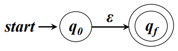
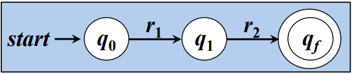
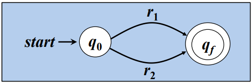
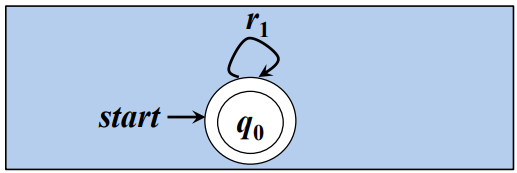
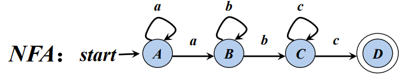
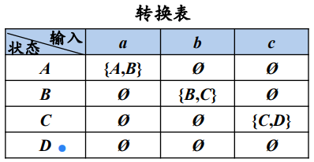
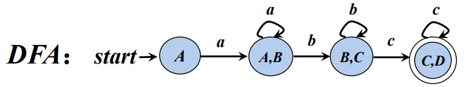
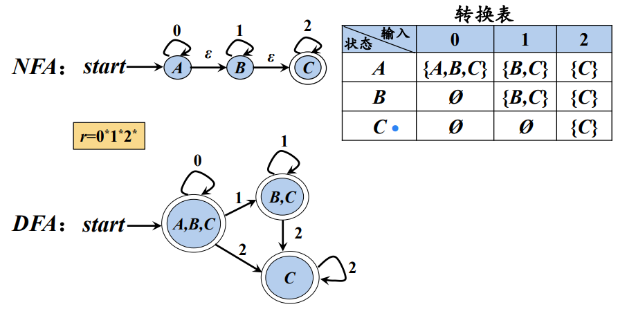

## 编译原理作业：
  - [正则表达式生成NFA/DFA](/static-sites/dfa)
  - [LL1 词法分析](/static-sites/ll1)
  - [LR 词法分析](/static-sites/lr)

## 编译程序的功能组织结构图
  - '词法分析器→语法分析器→语义分析器→中间代码生成器→代码优化器→目标代码'
  - 语法分析树和抽象语法树不是一个玩意儿(问题不大)
  - 词法分析
    - 调度场算法
      - 
      - 使用栈针对不同运算符的优先级进行处理
  - Chomsky四型文法
    - 0型文法
      - 无限制文法/短语结构文法
        - 设G=（VN，VT，P，S），如果它的每个产生式α→β是这样一种结构：α∈(VN∪VT)\*且至少含有一个非终结符，而 β∈(VN∪VT)\*，则G是一个0型文法。0型文法也称短语文法。一个非常重要的理论结果是：0型文法的能力相当于图灵机(Turing)。或者说，任 何0型文语言都是递归可枚举的，反之，递归可枚举集必定是一个0型语言。0型文法是这几类文法中，限制最少的一个。0型文法是其它类型文法的母集。
    - 1型文法
      - 上下文有关文法
        - 1型文法也叫上下文有关文法，此文法对应于线性有界自动机。它是在0型文法的基础上每一个α→β,都有|β|>=|α|。这里的|β|表示的是β的长度。
        - 注意：虽然要求|β|>=|α|，但有一特例：α→ε也满足1型文法。
        - 如有A->Ba则|β|=2,|α|=1符合1型文法要求。反之,如aA->a，则不符合1型文法。
    - 2型文法
      - 上下文无关文法
        - 在1型文法的基础上，每一个α→β都有α是非终结符。
        - 如A->Ba,符合2型文法要求。
        - 如Ab->Bab虽然符合1型文法要求,但不符合2型文法要求，因为其α=Ab，而Ab不是一个非终结符。
    - 3型文法
      - 正则文法
        - 对应有限状态自动机。
        - 在2型文法的基础上满足:A→α|αB（右线性）或A→α|Bα（左线性）。
        - 如有：A->a,A->aB,B->a,B->cB，则符合3型文法的要求。
        - 但如果推导 为:A->ab,A->aB,B->a,B->cB或推导 为:A->a,A->Ba,B->a,B->cB则不符合3型方法的要求了。
        - 具体的说，例子 A->ab,A->aB,B->a,B->cB中的A->ab不符合3型文法的定义,如果把后面的ab,改成“一个非终结符＋一个终结符”的形式（即为aB）就对了。例子A->a,A->Ba,B->a,B->cB中如果把B->cB改为 B->Bc的形式就对了,**因为A→α|αB（右线性）和A→α|Bα（左线性）两套规则不能同时出现在一个语法中,只能完全满足其中的一个,才能算 3型文法。**
  - 正则表达式
    - | ：或
    - \* ：匹配0或无限个
    - · ：连接
    - 优先级：*、·、|
    - 例如：
      - 令 ∑ = {a, b}，则
      - L(a|b) = L(a)∪L(b) ={a}∪{b} = {a, b}
      - L((a|b)(a|b)) = L(a|b) L(a|b)={a, b}{a, b}= { aa, ab, ba, bb }
      - L(a\*) = (L(a))\*= {a}\*= { ε, a, aa, aaa, . . . }
      - L((a|b)\*) = (L(a|b))\* = {a, b}\*= { ε, a, b, aa, ab, ba, bb, aaa, . . .}
      - L(a|a\*b) = { a, b, ab, aab, aaab, . . .}
## 有穷自动机(FA)
  - 具有有穷个状态数
    - 最长子串匹配原则：输入串的多个前缀与一个或多个模式匹配时，总是选择最长的前缀进行匹配。
  - NFA(非确定的FA)
    - NFA是不唯一的，但其对应的DFA是唯一的
    - ε对应的NFA 
    - r = r1r2对应的NFA 
    - r = r1|r2 对应的NFA 
    - r = (r1)\*对应的NFA 
  - DFA(确定的FA)
    - DFA每个状态都是一个由NFA状态构成的集合，也就是NFA状态集合的一个子集。例如NFA中状态A可以经由a边到达状态A、B，则DFA中状态A可经由a边到达状态 {A,B} ，这里 {A,B}集合是一个状态。
    - NFA→DFA：初始状态ε闭包T，求出后遍历终结符，对每个move(T,a)求ε闭包，求出的闭包为新的状态U，a即当前终结符，意思是T通过a到达U，将U换为T继续执行，直到没有新的U出现。
    - 如图所示 `r=aa*bb*cc*` 的无ε边的NFA到DFA的转换：
      1. 无ε边的NFA到DFA的转换 
      2. NFA状态转换表 
      3. 转换后的DFA 
    - 如图所示为带ε边的NFA到DFA的转换 
  - DFA最小化：
    - 状态合并：将所有状态划分为终结状态和非终结状态，并将终结状态和非终结状态进行合并，合并规则为:二者同为终结状态或非终结状态，且通过指定输入符号可以到达的状态相同。
    - ε-闭包(ε-closure)
      - ε-closure(s)：能够从NFA状态s开始只通过ε转换到达的NFA状态集合
      - ε-closure(T)：能够从T中的某个NFA状态s开始，只通过ε转换到达的NFA状态集合
      - move(T, a)：能够从T中的某个状态s出发通过标号为a的转换到达的NFA状态的集合
## 上下文无关文法
  - 二义性文法判断
    - 能通过不同分析顺序生成两个分析树的文法称为二义性文法
    - 消除二义性：不修改文法，指定正确的分析树；或修改文法(指定优先级、结合性)
  - 短语、简单短句和句柄判断
    - 短语：每颗子树的叶子
    - 简单短语：每颗简单子树(仅有叶子结点没有根节点)的叶子
    - 句柄：最左简单子树的叶子(最左边的那个简单子树)
## 自顶向下语法分析 （最左推导：既总是选择每个句型的最左非终结符进行替换）
  - 判定：产生式A → α | β 满足下面的条件：
    - 如果α 和β均不能推导出ε ，则FIRST (α)∩FIRST (β) =Φ(空集)
    - α 和β至多有一个能推导出ε
    - 如果 β →* ε，则FIRST (α)∩FOLLOW(A) =Φ; 如果 α →* ε，则FIRST (β)∩FOLLOW(A) =Φ; 
  - 消除左递归：(A → A α1 | A α2 | β1 | β2)→(A → β1 A′ | β2 A′;A′ → α1 A′ | α2 A′ | ε)
  - 间接左递归：将间接左递归文法的定义代入得到直接左递归，再消除
  - 提取左因子：(S → aAd | aBe)→(S → a S';S' → Ad | Be)
  - First、Follow
    - First：可以从X推导出的所有串首终结符构成的集合;可以存在ε
    - Follow：可能在某个句型中紧跟在A后边的终结符a的集合；如果A是某个句型的的最右符号，则将结束符“$”添加到FOLLOW(A)中；如果是起始的第一句，则添加“$”
  - LL(1)分析表
    - Select：将每条文法拆分为拓广文法，若该条文法A的First为ε，则Select(A)=Follow(A)，否则Select(A)=First(A)
    - 通过Select集合可以看到不同拓广文法产生式对应的终结符，使用其构建终结符与非终结符相对应的文法分析表即可。(考试记得写编号)
  - LL(1)分析过程
    - 分析栈：第一次为E，之后根据输入队列进行获取输入符号，通过输入符号和栈顶非终结符查找分析表进行文法推导，若为终结符则进行出栈匹配操作。
## 自底向上语法分析 （归约）
  - 拓广文法
    - 就是全写出来，然后在最前面加个S'→S，有手就行
  - LR(0)项目：
    - 加上小圆点的状态示意句柄
  - LR(0)识别活前缀状态机
    - 从第一条增广文法开始往下，列出所有可以推导出的项目，然后写出每个项目移进之后的状态，直到小圆点到了最后再也推导不出来新的状态，就是规约状态。
  - LR方法判断过程
  - LR(0)分析表、SLR(1)分析表
    - LR(0)分析表：
      - 分为两部分：Action和GOTO
        - ACTION：移进项目
        - GOTO：跳转到文法
    - SLR(1)分析表：
      - 如果下一个输入符号a属于移进项目，则移进；若a属于某个规约项目的Follow，则使用该规约项目进行规约
  - LR分析过程
  - LR(1)识别活前缀状态机
  - LALR(1)判断
  - LALR(1)识别活前缀状态机
  - LR(1)分析表、LALR(1)分析表
    - 如果除了展望符外，两个LR(1)项目集是相同的，则称这两个LR(1)项目集是同心的
    - LALR(1)状态机即合并同心项后的LR(1)状态机
  - LR分析过程
## 语义分析
  - 依赖图(拓扑排序)语义分析
  - S属性文法语义分析
  - L属性文法语义分析
## 中间代码三地址码的四元式、三元式表示
  - 四元式：(op,arg1,arg2,return)
  - 三元式：x=(t+r)\*y → t1=t+r;t2=t1\*r;x=t2;
## 基于基本块的DAG的中间代码优化
  - 基本块：程序中一段顺序执行的语句序列
  - 通过每一条三地址码或四元式构建节点，将相关的节点相连，若节点内容一样，在右边加上名字，节点下方为常量值或运算符。