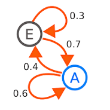

## 马尔可夫性质

马尔可夫链是由一个条件分布来表示的$P(X_{n+1}|X_N)$ ，这被称为随机过程中的转移概率。马尔可夫链即符合马尔可夫性质的随机变量序列，最简化的马尔可夫链即只有一个X1的状态的转移链。在这些随机变量中，它们的当前状态，将来状态和过去状态是相互独立的。

## 马尔可夫链

马尔可夫链是基于状态而言的，其性质有些类似有限状态自动机，但是与DFA之类的n有限状态自动机不同的是，在不同状态的转移之间并非是一个特定条件在进行约束，而是一个概率。状态机上所有的概率可以构成一个分布，名叫转移概率分布。

## 隐马尔可夫模型

隐马尔可夫模型引入了“生成概率”的概念，每一个状态都有自己的生成概率分布，可以按照不同的概率产生一组可以被观测到的符号。在隐马尔可夫模型中，状态路径是无法直接看到的。

在简单的马尔可夫模型（如马尔可夫链），所述状态是直接可见的观察者，因此状态转移概率是唯一的参数。在隐马尔可夫模型中，状态是不直接可见的，但输出依赖于该状态下，是可见的。每个状态通过可能的输出记号有了可能的概率分布。因此，通过一个HMM产生标记序列提供了有关状态的一些序列的信息。注意，“隐藏”指的是，该模型经其传递的状态序列，而不是模型的参数；即使这些参数是精确已知的，我们仍把该模型称为一个“隐藏”的马尔可夫模型。隐马尔可夫模型以它在时间上的模式识别所知，如语音，手写，手势识别，词类的标记，乐谱，局部放电和生物信息学应用。

https://www.coursera.org/learn/sheng-wu-xin-xi-xue/lecture/uekgI/yin-ma-er-ke-fu-mo-xing